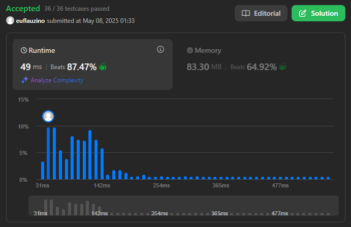
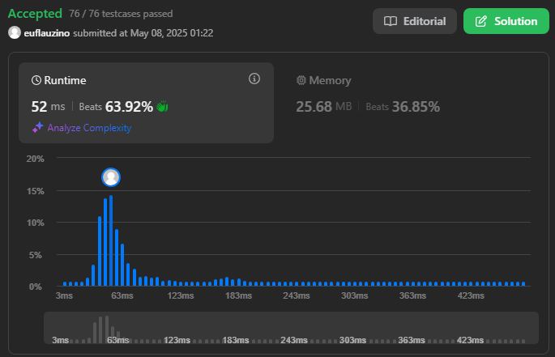

# Juiz Virtual (LeetCode)

**Número da Lista**: 2 
**Conteúdo da Disciplina**: Grafos 2  

## Alunos
|Matrícula | Aluno |
| -- | -- |
| 22/2006178 | Thales Henrique Euflauzino dos Santos  |
| 22/2021924 | Víctor Hugo Lima Schmidt               |

## Sobre 
Para explorar o conteúdo do tópico de Grafos 2, a dupla escolheu dois exercícios na plataforma online [LeetCode](https://leetcode.com/): dois de nível difícil e dois de nível médio, para igualar o trabalho de cada um dos membros.

## Screenshots

### [2642. Design Graph With Shortest Path Calculator (Difícil)](https://leetcode.com/problems/design-graph-with-shortest-path-calculator/description/)

Modelei o problema como um grafo dirigido onde cada aresta possui um custo. Usei Dijkstra com uma fila de prioridade para encontrar o caminho de menor custo entre dois nós, atualizando as distâncias apenas quando um caminho mais barato era encontrado. Essa abordagem é eficiente para grafos com pesos positivos e permite lidar com adições dinâmicas de arestas.

### [1631. Path With Minimum Effort (Média)](https://leetcode.com/problems/path-with-minimum-effort/description/)

Modelei o problema como um grafo onde cada célula é um nó e arestas conectam células adjacentes com peso igual à diferença de altura. Usei Dijkstra com uma fila de prioridade para minimizar o maior peso (esforço) no caminho do topo esquerdo até o canto inferior direito, atualizando apenas se o novo esforço for menor que o registrado.

## Instalação 
**Linguagens**: C++ e C 

## Uso 
Explique como usar seu projeto caso haja algum passo a passo após o comando de execução.

